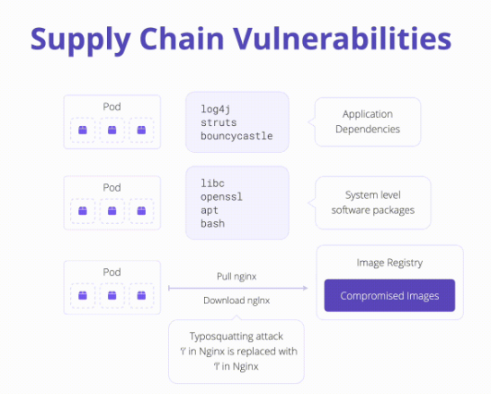

# K02: Supply Chain Vulnerabilities

# Problem

A container can rely on hundreds of third-party components and dependencies.Trust of origin of these dependencies is extremely difficult. Challenges include image integrity, composition, and known software vulnerabilities.



1. **Image Integrity:** Happens at software provenance, when systems of record regarding the contents of a container image do not exist
1. **Image Composition:** A container image consists of layers, each of which can present security implications. Images with extraneous software can be leveraged to elevate privileges or exploit known vulnerabilities
1. **Known Software Vulnerabilities:** When software uses third-party packages that is susceptible to a known exploit, then container images are dangerous to pull into a trusted environment and run - malicious workload can put an entire cluster at risk

# Exploit

Known Software Vulnerabilities

## Kubernetes

```shell
cat devops/docker/Dockerfile; echo
docker build -t ldynia/hackme-app:v2 --build-arg INDEX_VERSION=v2 -f devops/docker/Dockerfile .
docker push ldynia/hackme-app:v2

cat devops/k8s/manifests/k02/hack.pod.yaml; echo
kubectl apply -f devops/k8s/manifests/k02/hack.pod.yaml
kubectl port-forward pod/hackme-app 8080:80 &
```

Visit app at [localhost:8080](http://localhost:8080/)

# Mitigations

1. **Image Integrity:** Docker images are software artifacts passed from a producer to a consumer. The handoff can be a developer’s IDE directly connected to a Kubernetes cluster or a multi-step CI/CD workflow. The integrity of the software should be validated through each phase using [in-toto attestations](https://github.com/in-toto/attestation).
1. **Image Composition:** Container images should be created using minimal OS packages and dependencies. Consider utilizing images such as **Distroless** or **Scratch**. [Docker Slim](https://github.com/slimtoolkit/slim) tool can size down docker images.
1. **Known Software Vulnerabilities:** Use image vulnerability scanners such [Clair](https://github.com/quay/clair), [Trivy](https://github.com/aquasecurity/trivy) or [JFrog Xray](https://jfrog.com/) these tools will statically analyze container images for known vulnerabilities such as CVEs and should be used as early in the development cycle as reasonably possible.
1. **Enforcing Policy:** Prevent unapproved images from being used with the Kubernetes by using admission controls and policy engines such as [Open Policy Agent](https://www.openpolicyagent.org/) and [Kyverno](https://kyverno.io/) to reject workloads images which:

# Links

- [K02 supply chain vulnerabilities](https://owasp.org/www-project-kubernetes-top-ten/2022/en/src/K02-supply-chain-vulnerabilities)
- [Docker Slim](https://github.com/slimtoolkit/slim)
- [Clair](https://github.com/quay/clair)
- [Trivy](https://github.com/aquasecurity/trivy)
- [jFrog Xray](https://jfrog.com/)
- [Open Policy Agent](https://www.openpolicyagent.org/)
- [Kyverno](https://kyverno.io/)